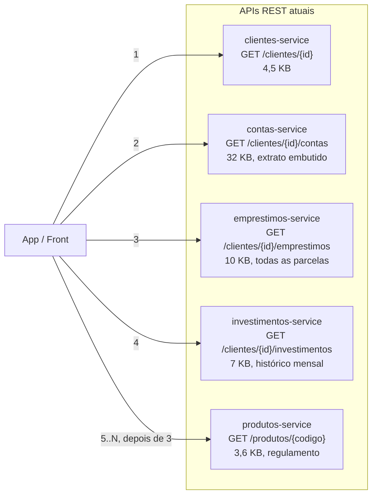
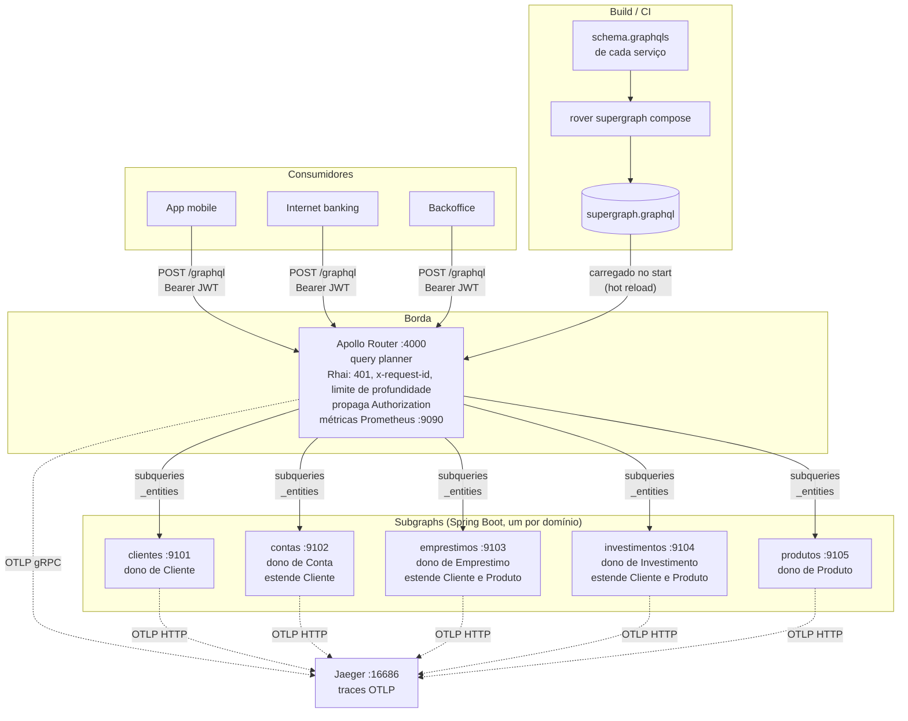
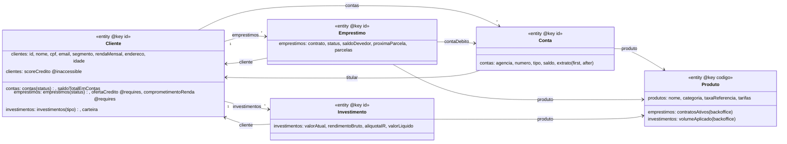
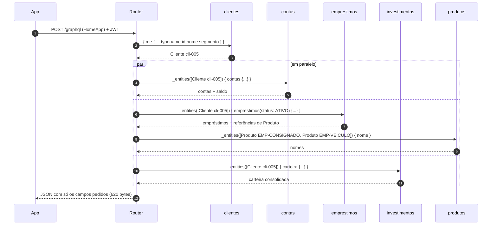
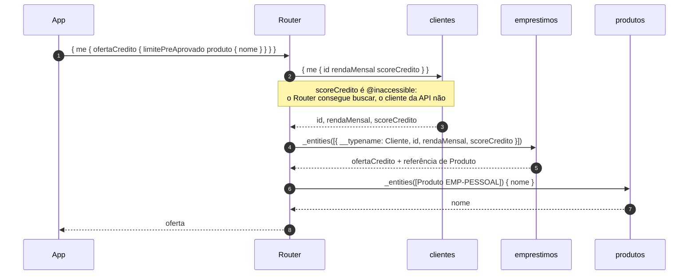
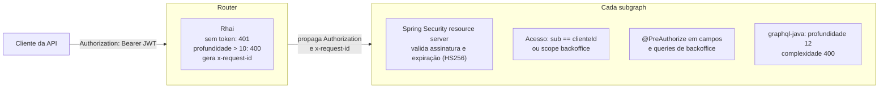

# POC: GraphQL Federation para APIs de consulta

POC de **GraphQL Federation v2** com cinco domínios de um banco (clientes, contas, empréstimos,
investimentos e produtos). Cada serviço continua dono dos próprios dados e expõe um **subgraph**. O **Apollo Router**
junta tudo em um único grafo, e quem consome faz **uma chamada e recebe só os campos que pediu**.

Stack: Java 21, Spring Boot 4.1, Spring for GraphQL 2.0 (`@EntityMapping`, `@BatchMapping`), federation-jvm 6.2,
Apollo Router 2.16, Rover 0.41 (composição), OpenTelemetry e Jaeger.

- [O problema](#o-problema)
- [Arquitetura](#arquitetura)
- [Modelo federado](#modelo-federado)
- [Como uma query é executada](#como-uma-query-é-executada)
- [Segurança](#segurança)
- [Resultados](#resultados-rest-x-graphql)
- [Como rodar](#como-rodar)
- [Consultas de exemplo](#consultas-de-exemplo)
- [Recursos de federação usados](#recursos-de-federação-usados)
- [Estrutura do repositório](#estrutura-do-repositório)
- [Decisões e trade-offs](#decisões-e-trade-offs)
- [Caminho para produção](#caminho-para-produção)
- [Limitações da POC](#limitações-da-poc)

---

## O problema

Hoje cada domínio tem uma API REST de consulta. Para montar uma tela, o front (ou um BFF) precisa:

1. **Fazer várias chamadas.** Uma por domínio, e às vezes em cascata: busca os empréstimos, depois busca o produto de
   cada empréstimo para mostrar o nome.
2. **Receber muito mais do que usa.** O `GET /emprestimos` devolve todas as parcelas, documentos e seguro, e a tela
   só mostra saldo devedor e próxima parcela. O `GET /contas` traz o extrato inteiro embutido e a tela só usa o saldo.



Na tela inicial do app da POC isso dá **6 requisições, 2 round-trips em sequência e 61,7 KB** para exibir
algo em torno de 600 bytes de informação.

## Arquitetura



Pontos principais:

- **Cada serviço continua dono dos seus dados.** O subgraph fica *dentro* do serviço existente, ao lado do REST
  (`/api/v1/...` e `/graphql` no mesmo app). Não há um "serviço GraphQL" central com regra de negócio.
- **O Router não tem regra de negócio.** Ele recebe a operação, monta o *query plan* a partir do supergraph e chama
  os subgraphs em paralelo quando dá, ou em sequência quando um depende do outro.
- **A composição acontece no build, não em runtime.** `rover supergraph compose` valida se os schemas dos cinco
  subgraphs são compatíveis e gera o `supergraph.graphql`. Se alguém quebrar o contrato, a composição falha antes do deploy.
- **O REST continua no ar.** A migração pode ser gradual, tela a tela.

## Modelo federado

Cada entidade tem um subgraph dono, que define a chave (`@key`). Os outros subgraphs **estendem** a entidade com
os campos que são deles:



Os relacionamentos atravessam serviços sem nenhum deles chamar o outro por HTTP. O `emprestimos-service`
só guarda `contaDebitoId` e `produtoCodigo` e devolve referências `{ __typename: "Conta", id }`.
Quem completa os dados é o Router, que chama o subgraph dono.

## Como uma query é executada

### Tela inicial (`consultas/01-home-app.graphql`)

```graphql
query HomeApp {
  me {
    nome
    segmento
    contas { id tipo saldo { disponivel } }
    emprestimos(status: ATIVO) {
      id
      produto { nome }
      saldoDevedor
      proximaParcela { numero vencimento valor }
    }
    carteira { patrimonioBruto rentabilidadePercentual }
  }
}
```

Query plan real gerado pelo Router (pode ser visto com o header `Apollo-Expose-Query-Plan: true`):



Os produtos dos dois empréstimos são buscados em **uma única** chamada `_entities` com duas representações.
O `produtos-service` resolve as duas de uma vez com `@EntityMapping` em lote. É o DataLoader acontecendo
entre serviços.

### Oferta de crédito com `@requires` (`consultas/02-oferta-credito.graphql`)

A oferta depende da renda e do score do cliente, e esses dados são do `clientes-service`. Em vez de o
`emprestimos-service` chamar o `clientes-service`, o schema declara a dependência:

```graphql
type Cliente @key(fields: "id") {
  id: ID!
  rendaMensal: Decimal! @external
  scoreCredito: Int! @external
  ofertaCredito: OfertaCredito! @requires(fields: "rendaMensal scoreCredito")
}
```



`scoreCredito` é marcado como `@inaccessible` no subgraph clientes. Ele circula entre os subgraphs, mas
**não existe na API pública**: `{ me { scoreCredito } }` retorna `GRAPHQL_VALIDATION_FAILED`.

## Segurança



- **A borda barra cedo** (sem token ou query profunda demais) e **o subgraph decide**. Todo subgraph valida o JWT,
  porque é possível chamar o subgraph direto, sem passar pelo Router. É defesa em profundidade.
- **A autorização é feita por entidade, inclusive em `_entities`.** Se o Router pedir `Cliente cli-001` com o token do
  `cli-005`, o subgraph responde `FORBIDDEN` naquela posição e o resto da resposta continua funcionando.
- **Campos restritos são nullable** (`contratosAtivos: Int`), o que permite **resposta parcial**. Um cliente que pede o
  catálogo com indicadores recebe o catálogo e `null` + erro `FORBIDDEN` só nos indicadores. Se o campo fosse `Int!`,
  o erro subiria e anularia a lista inteira.
- Tokens: `sub` é o id do cliente e `scope` é `cliente` ou `backoffice`. O script `scripts/gerar-token.sh` gera tokens de teste.

## Resultados: REST x GraphQL

Medido com `scripts/comparar-rest-graphql.sh cli-005`, depois do aquecimento, tudo local:

| | REST (hoje) | GraphQL Federation |
|---|---:|---:|
| Requisições do cliente | 6 | **1** |
| Round-trips em sequência | 2 | **1** |
| Bytes trafegados | 61.666 | **620** |
| Redução de payload | | **99%** |

A visão 360 do backoffice (`consultas/04-visao-360-backoffice.graphql`: 5 clientes com saldo, carteira,
empréstimos, comprometimento de renda e oferta) sai em **1 chamada de 2,7 KB**. Em REST seriam 5 × (4 + N) chamadas.

Sobre latência: localmente cada chamada REST leva ~6 ms e a query federada ~24 ms, porque o Router faz 2 ondas de
subchamadas. Em rede móvel real (RTT de 80 a 300 ms), o que pesa é o número de round-trips e o tamanho do payload.
Nesse cenário, 1 round-trip de 620 bytes ganha com folga de 2 round-trips e 61 KB. Entre o Router e os subgraphs
a rede é de datacenter.

## Como rodar

Pré-requisitos: Docker. Para desenvolver também: JDK 21+, Maven 3.9+, Node (para `npx` do Rover) e `jq`.

```bash
docker compose up -d --build

./scripts/testar-e2e.sh
./scripts/comparar-rest-graphql.sh cli-005
```

| Endereço | O que é |
|---|---|
| http://localhost:4000/graphql | Router (POST) e Apollo Sandbox (abrir no navegador) |
| http://localhost:16686 | Jaeger: trace de uma query passando por Router e subgraphs |
| http://localhost:9090/metrics | Métricas Prometheus do Router (latência por subgraph etc.) |
| http://localhost:9101..9105/graphql | Subgraphs direto (clientes, contas, empréstimos, investimentos, produtos) |
| http://localhost:9101..9105/api/v1/... | APIs REST "legadas" com o payload completo |

No Sandbox, adicione o header `Authorization: Bearer <token>`:

```bash
./scripts/gerar-token.sh cli-005 cliente
./scripts/gerar-token.sh operador-01 backoffice
```

### Rodar uma consulta pelo terminal

```bash
./scripts/consultar.sh consultas/01-home-app.graphql
./scripts/consultar.sh consultas/03-extrato-paginado.graphql '{"contaId":"cta-005-1"}' cli-005
./scripts/consultar.sh consultas/04-visao-360-backoffice.graphql '{"filtro":{"uf":"SP"}}' operador backoffice
PLANO=1 ./scripts/consultar.sh consultas/02-oferta-credito.graphql | jq -r .extensions.apolloQueryPlan.text
```

### Mudou um schema?

```bash
./scripts/compor-supergraph.sh
docker compose up -d --build <serviço>
```

O Router roda com `--hot-reload` e recarrega o supergraph sozinho.

### Testes

```bash
mvn test
```

São 26 testes: resolução de entidades (`_entities`), `@requires` com a representação que o Router envia,
autorização por cliente e por escopo, paginação por cursor, Tabela Price e IR regressivo, e 401/403 no HTTP.

## Consultas de exemplo

| Arquivo | O que demonstra |
|---|---|
| `01-home-app.graphql` | 5 subgraphs em 1 chamada, fetches em paralelo, `_entities` em lote |
| `02-oferta-credito.graphql` | `@requires` + `@external` + `@inaccessible` |
| `03-extrato-paginado.graphql` | Paginação por cursor (Relay), filtros por argumento, navegação conta > titular |
| `04-visao-360-backoffice.graphql` | Lista paginada + extensões de 4 subgraphs por item, `@BatchMapping`, escopo backoffice |
| `05-simulacao.graphql` | Query com input, erro `BAD_REQUEST` de domínio, referência a Produto |
| `06-catalogo-backoffice.graphql` | Campos do mesmo tipo vindos de 3 subgraphs e resposta parcial com erro de autorização |
| `07-detalhe-emprestimo.graphql` | Entidade que aponta para Cliente, Conta e Produto em outros subgraphs |

## Recursos de federação usados

| Recurso | Onde | Para quê |
|---|---|---|
| `@key(fields: "id")` | `Cliente`, `Conta`, `Emprestimo`, `Investimento` | Identidade da entidade entre subgraphs |
| `@key(fields: "codigo")` | `Produto` | Chave de negócio em vez de id técnico |
| Extensão de entidade | `Cliente` em contas, emprestimos, investimentos | Cada domínio adiciona os próprios campos |
| `@key(..., resolvable: false)` | `Produto` em contas, `Conta` em emprestimos | Subgraph só referencia, não resolve |
| `@external` + `@requires` | `Cliente.ofertaCredito` | Usar dado de outro subgraph sem chamada HTTP entre serviços |
| `@inaccessible` | `Cliente.scoreCredito` | Dado interno da federação, fora da API pública |
| `@shareable` | `PageInfo` | Value type definido igual em mais de um subgraph |
| `@EntityMapping` em lote | `Produto` em produtos | Resolver N representações com 1 acesso |
| `@BatchMapping` | `Cliente.saldoTotalEmContas`, `Cliente.carteira` | Evitar N+1 dentro do subgraph |
| Resposta parcial | `Produto.contratosAtivos`, `Produto.volumeAplicado` | Erro em um campo não derruba a resposta |
| Query plan exposto | `Apollo-Expose-Query-Plan: true` | Depuração e ensino |

## Estrutura do repositório

```
graphql-federation-poc/
├── common/                      # biblioteca compartilhada pelos subgraphs
│   ├── config/                  # FederationSchemaFactory, scalars (Decimal, Date, DateTime), limites
│   ├── seguranca/               # resource server JWT, Acesso (cliente x backoffice)
│   ├── paginacao/               # Conexao<T> (Relay connection)
│   ├── erro/                    # mapeamento de exceções para GraphQL e REST
│   └── dados/                   # seed determinístico e códigos de produto
├── clientes-service/            # subgraph dono de Cliente
├── contas-service/              # subgraph dono de Conta, estende Cliente
├── emprestimos-service/         # subgraph dono de Emprestimo, estende Cliente (@requires) e Produto
├── investimentos-service/       # subgraph dono de Investimento, estende Cliente e Produto
├── produtos-service/            # subgraph dono de Produto
│   └── src/main/resources/graphql/schema.graphqls   # contrato do subgraph (cada serviço tem o seu)
├── supergraph/
│   ├── supergraph.yaml          # lista de subgraphs para o Rover
│   └── supergraph.graphql       # gerado: contrato composto usado pelo Router
├── router/
│   ├── router.yaml              # config do Apollo Router
│   └── rhai/main.rhai           # 401, x-request-id, limite de profundidade
├── consultas/                   # operações de exemplo
├── scripts/                     # token, composição, consulta, e2e, comparação REST x GraphQL
├── docker-compose.yml
└── Dockerfile                   # multi-stage, um build por módulo (ARG MODULE)
```

Cada serviço segue o mesmo desenho:

```
XxxApplication         Spring Boot
Xxx (record)           modelo de domínio
XxxRepository          dados em memória com seed determinístico
XxxGraphQlController   @QueryMapping, @SchemaMapping, @BatchMapping, @EntityMapping
XxxRestController      endpoint REST "legado" com payload completo, para comparação
schema.graphqls        contrato do subgraph
```

## Decisões e trade-offs

**Federation, não schema stitching nem BFF único.** No stitching ou em um BFF GraphQL central, uma equipe
vira dona de tudo e gargalo de todas as mudanças. Na federation cada domínio publica o próprio pedaço do grafo e
o Router só orquestra. Isso segue a mesma divisão de times que já existe nos microsserviços.

**Subgraph dentro do serviço existente, e não uma fachada GraphQL chamando o REST.** A fachada sobre o REST é mais
rápida de começar, mas mantém o over-fetching entre fachada e serviço e cria mais um salto de rede. Colocar o
`/graphql` no próprio serviço reaproveita repositório e regras e deixa o REST e o GraphQL lado a lado durante a
migração. A fachada ainda é uma opção válida para serviços legados que não dá para mexer.

**Apollo Router.** Padrão de mercado, em Rust, com query planner maduro, hot reload, OpenTelemetry nativo e Rhai
para customizações leves. Algumas funcionalidades são **Enterprise (GraphOS)**: limites de profundidade/aliases no
Router, autenticação JWT no Router, diretivas `@authenticated`/`@requiresScopes`, demand control, entity cache e
coprocessors. A POC usa só o que é gratuito e cobre o resto assim:
- profundidade: Rhai na borda (aproximação por chaves) + `MaxQueryDepthInstrumentation` e
  `MaxQueryComplexityInstrumentation` em cada subgraph;
- autenticação: validação do JWT em cada subgraph (que precisaria existir de qualquer forma).

Alternativa 100% open source com essas funcionalidades: **Hive Gateway** (The Guild, MIT), que usa o mesmo
supergraph. Trocar de gateway não exige mudança nos subgraphs.

**Composição no build.** O supergraph é um artefato versionado. Quebra de contrato aparece como erro de composição
e não em produção. Em produção isso vira `rover subgraph check` no CI de cada serviço contra um schema registry.

**Autorização no subgraph, por entidade.** Toda porta de entrada (`Query.conta`, `_entities` de `Conta`,
`_entities` de `Cliente`) verifica o dono. Sem isso, um cliente poderia montar uma query que chega a dados de
outro por um caminho de relacionamento.

**Nullability pensada para falha parcial.** Campos que podem falhar por autorização ou dependência são nullable.
Campos centrais da entidade continuam `!`.

**Scalars próprios.** `Decimal` para dinheiro (nunca `Float`), `Date` e `DateTime` em ISO-8601.

### O que se perde em relação ao REST (e como mitigar)

| Ponto | Mitigação |
|---|---|
| Cache HTTP/CDN por URL não funciona com POST | Persisted queries (APQ com GET), `@cacheControl`, entity cache no Router, cache no subgraph |
| Queries arbitrárias podem ser caras | Limites de profundidade/complexidade (feito), persisted queries com safelist, demand control |
| N+1 entre serviços | O Router agrupa representações; `@EntityMapping` em lote e `@BatchMapping` no subgraph (feito) |
| Mais uma peça na borda | Router é stateless, escala horizontal e expõe health (:8088) e métricas (:9090) |
| Erros com HTTP 200 | `errors[].extensions.classification` padronizado (feito); métricas por código de erro no Router |
| Observabilidade de uma request espalhada | Trace distribuído Router + subgraphs no Jaeger (feito), `x-request-id` propagado (feito) |

## Caminho para produção

1. **Schema registry e checks.** Publicar cada subgraph (GraphOS ou Hive) e rodar `rover subgraph check` no pipeline
   de cada serviço. O check quebra o build se a mudança não compõe ou se quebra operações usadas nos últimos N dias.
2. **Governança de schema.** Convenções de nomes, paginação Relay em toda lista grande, `Decimal` para dinheiro,
   deprecação com `@deprecated` antes de remover campo, dono de cada entidade documentado.
3. **Segurança na borda.** JWT validado no Router (Enterprise ou Hive Gateway), persisted queries com safelist para os
   apps próprios, rate limiting por cliente e desligar introspecção e Sandbox em produção.
4. **Performance.** Entity cache ou cache nos subgraphs para dados estáveis (catálogo de produtos), `@defer` para
   partes lentas da tela e monitorar o p95 por subgraph (`http_client_request_duration_seconds`).
5. **Migração incremental.** Começar pelas telas com mais chamadas (home, visão 360). Manter o REST até o último
   consumidor migrar, acompanhando o uso pelos logs. Usar `@override(from:, label: "percent(10)")` quando um campo
   mudar de subgraph dono.
6. **Mutations.** A POC é só consulta. Operações de escrita podem continuar em REST ou virar mutations no subgraph
   dono do dado, nunca orquestradas no Router.

## Limitações da POC

- Os dados são gerados em memória com seed determinístico (IDs `cli-001` a `cli-030`), sem banco.
- O limite de profundidade em Rhai conta chaves e pode ser contornado com fragments. A proteção real é a de cada
  subgraph (graphql-java).
- JWT HS256 com segredo compartilhado, só para a POC. Em produção: RS256/ES256 com JWKS do IdP.
- Um único ambiente (docker compose). Não há schema registry nem checks de CI configurados.
